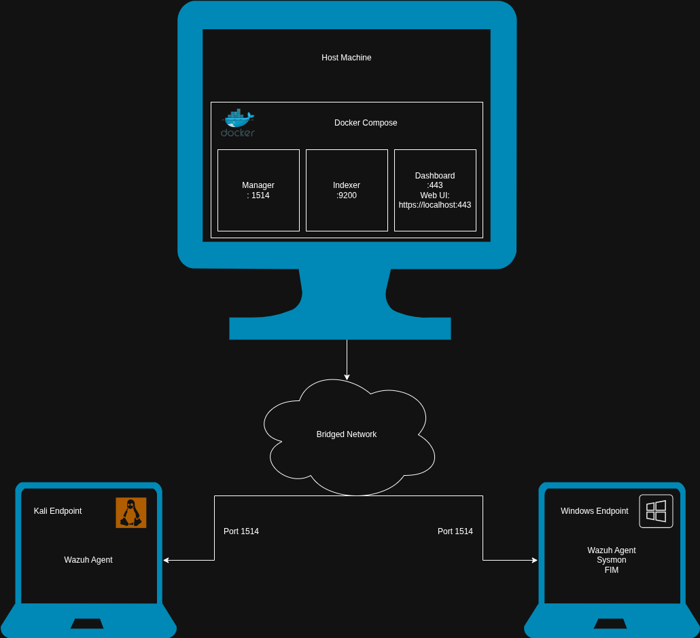

# SOC Home Lab
A Security Operations Center home lab vuilt with Wazuh SIEM/XDR for learning threat detection, log analysis and incident response. 

## Overview
This project simulates an enterprise security monitoring environment with centralized log collection, real-time threat detection, and MITRE ATT&CK mapped detection rules.

### What I built:
- Wazuh SIEM/XDR platform deployed on Docker Compose
- Windows and Linux endpoints with security monitoring agents
- Sysmon integration for deep Windows telemetry
- File Integrity Monitoring for critical directories
- Custom detection rules for common attack techniques
## Architecture
<p align="center">
  
</p>

## Components
| Component | Purpose | Why I Chose It |
|-----------|---------|----------------|
| Wazuh     | SIEM/XDR platform | Free alternative to Splunk with similar capabilities |
| Docker Compose  | Multi-container orchestration| Deploys all Wazuh components (manager, indexer, dashboard) with single command |
| Sysmon | Windows telemetry | Windows Event Logs alone didn't show me command line arguments or parent processes |
| Kali Linux | Linux endpoint | Comes with attack tools pre-installed for simulating threats |
| Windows 10 | Windows endpoint |  Most enterprise attacks target Windows |
## Detection Coverage
### MITRE ATT&CK Techniques
| Technique ID | Name | Detection Method |
|--------------|------|------------------|
| T1059.001 | PowerShell | Sysmon Event ID 1 |
| T1110 | Brute Force | Failed auth patterns |
| T1547.001 | Registry Run Keys | Sysmon Event ID 13 |

## Project Structure
```
soc-home-lab/
├── README.md
├── images/
│   └── architecture.png
├── configs/
│   ├── ossec-windows.conf
│   ├── ossec-linux.conf
│   └── sysmonconfig.xml
├── detection-rules/
│   └── custom-rules.md
├── documentation/
│   ├── phase1-setup.md
│   ├── phase2-detections.md
│   └── phase3-investigations.md
```
## Resources 
- https://documentation.wazuh.com/current/deployment-options/docker/wazuh-container.html
- https://www.youtube.com/watch?v=QT81wcuoRFY&t=634s
- https://attack.mitre.org/techniques/enterprise/
- https://documentation.wazuh.com/current/user-manual/ruleset/rules/custom.html
- https://smallstep.com/blog/diy-ssh-bastion-host/
